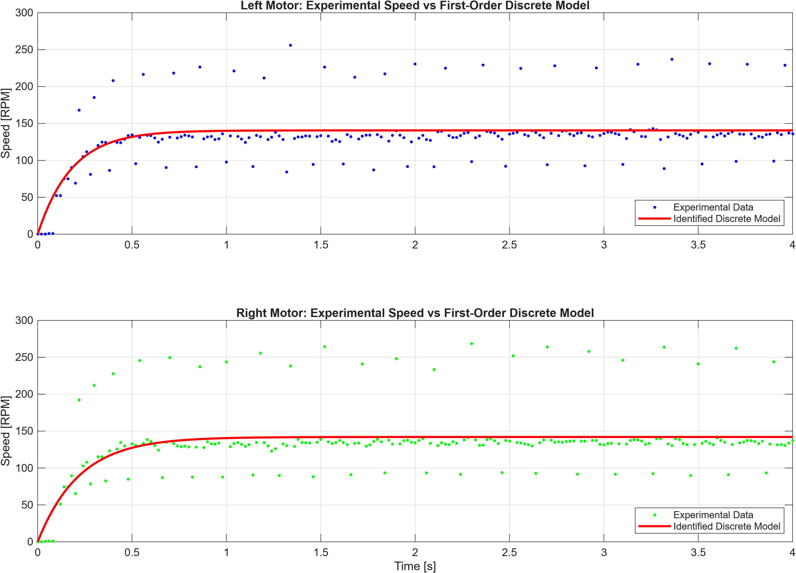
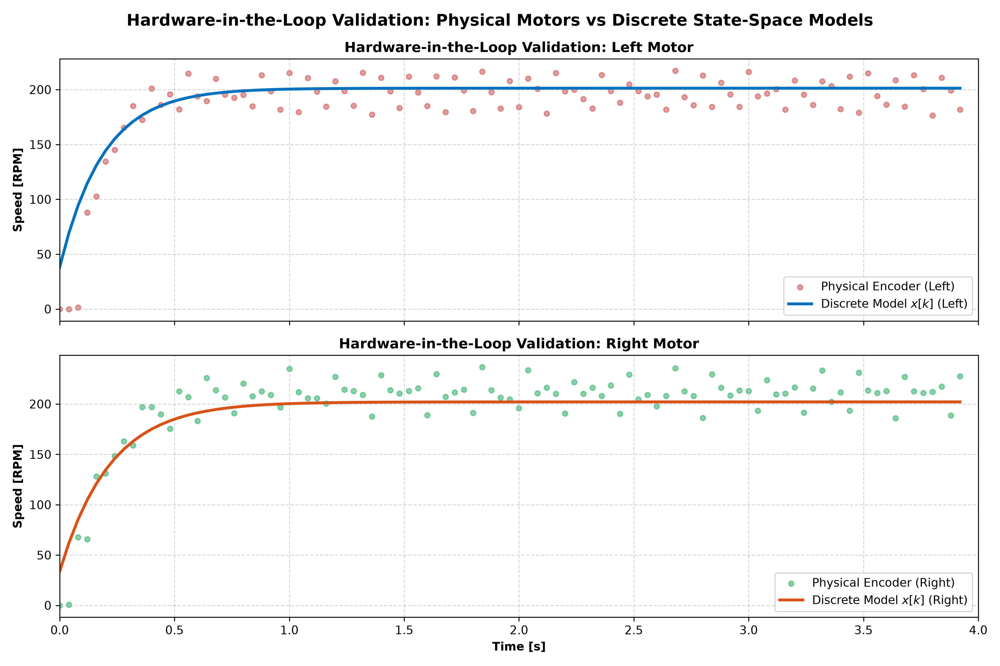

# Project 08: Real-Time Discrete State-Space Identification and HIL Validation

This repository contains the physical dynamic modeling, continuous and discrete state-space formulation, M/T speed measurement implementation, and real-time Hardware-in-the-Loop (HIL) cross-validation of DC motor speed dynamics on a differential wheeled robot.

---

## Project Overview

While previous iterations (Project 07) focused on model-free PID control without knowledge of motor physics, **Project 08** identifies the physical motor dynamics ($K$ and $\tau$) to build a mathematical state-space model.

The primary objective is to derive a first-order continuous dynamic model from physical principles, convert it into a discrete state-space representation at a sampling period of $T_s = 20\text{ ms}$, identify baseline system parameters under a step input of $\text{PWM} = 100$, and cross-validate model fidelity in real time inside an Arduino UNO under an unseen profile ($\text{PWM} = 150$) as well as across the full operating range ($\text{PWM } 30 \text{ to } 255$).

---

## Physical Modeling and Derivation

### 1. Mechanical Equation of Motion (Newton's 2nd Law for Rotation)

Applying Newton's Second Law for rotational systems to the motor shaft:

$$\sum T = I \cdot \alpha(t)$$

$$T(t) - T_{\text{friction}}(t) = I \frac{d\omega(t)}{dt}$$

Assuming linear viscous friction $T_{\text{friction}}(t) = b \cdot \omega(t)$ and electromagnetic torque proportional to input $u(t)$ ($T(t) = K_m \cdot u(t)$):

$$K_m u(t) = I \frac{d\omega(t)}{dt} + b \omega(t)$$

Taking the Laplace transform under zero initial conditions:

$$K_m U(s) = I s W(s) + b W(s) \implies \frac{W(s)}{U(s)} = \frac{K_m}{I s + b}$$

Dividing numerator and denominator by the viscous damping coefficient $b$ yields the standard first-order Transfer Function:

$$G(s) = \frac{W(s)}{U(s)} = \frac{K}{\tau s + 1}$$

Where the physical parameters are defined as:
* **Static Gain ($K = \frac{K_m}{b}$):** Represents steady-state output per unit input ($\text{RPM} / \text{PWM}$) at $s = 0$.
* **Time Constant ($\tau = \frac{I}{b}$):** Represents mechanical system inertia, defined as the time required to reach $63.2\%$ of the steady-state velocity ($y_{ss}$). At $t = 4\tau$, the system reaches $\approx 98\%$ of its final speed.

> **Model Order Reduction:** The real electro-mechanical motor is technically a 2nd-order system. However, because electrical dynamics (inductance/resistance time constants) are significantly faster than the mechanical dynamics, the electrical domain collapses, simplifying the system to 1st order without significant loss of accuracy.

---

### 2. Continuous State-Space Representation

Converting the differential equation $\tau \dot{\omega}(t) + \omega(t) = K u(t)$ into continuous state-space form ($\dot{x}(t) = A x(t) + B u(t)$, $y(t) = C x(t) + D u(t)$):

$$\dot{x}(t) = \left[-\frac{1}{\tau}\right] x(t) + \left[\frac{K}{\tau}\right] u(t)$$

$$y(t) = [1] x(t) + [0] u(t)$$

* **$A$ (Dynamic Matrix):** Describes natural system dissipation ($-\frac{1}{\tau}$). Its eigenvalue defines the continuous system pole.
* **$B$ (Input Matrix):** Quantifies how input commands directly alter the state ($\frac{K}{\tau}$).
* **$C$ (Output Matrix):** Maps internal state $x(t)$ to encoder speed measurements $y(t)$ ($C = 1$).
* **$D$ (Direct Transmission Matrix):** Set to zero ($D = 0$), indicating no instantaneous feedthrough from input to output.

---

### 3. Discrete-Time State-Space Representation ($T_s = 20\text{ ms}$)

While physical motor dynamics are continuous, microcontrollers execute digitally in discrete time steps ($T_s = 20\text{ ms}$). To execute synchronously within the control loop, the system is discretized via Zero-Order Hold (ZOH):

$$x[k+1] = A_d \cdot x[k] + B_d \cdot u[k]$$

$$y[k] = C_d \cdot x[k] + D_d \cdot u[k]$$

Analytically derived discrete matrices:

$$A_d = e^{-\frac{T_s}{\tau}}$$

$$B_d = K \left(1 - e^{-\frac{T_s}{\tau}}\right) = K (1 - A_d)$$

$$C_d = 1, \quad D_d = 0$$

---

## Speed Measurement Method: M/T (Time-Interval) Principle

Standard pulse-counting techniques (M-method) count encoder pulses over a fixed sampling window ($T_s = 20\text{ ms}$). On low-resolution encoders ($20\text{ slots/revolution}$), counting $1$ vs $2$ pulses introduces severe quantization steps of $150\text{ RPM}$, obscuring low-speed dynamics. To improve measurement accuracy and resolution, velocity estimation was upgraded to the **M/T (Time-Interval) Method**, executed through three distinct algorithmic steps:

### Step 1: Consecutive Transition Time Measurement
Hardware interrupts are configured in `CHANGE` mode to capture both rising and falling edges of the encoder signal. The elapsed microsecond time interval ($dt$) between consecutive transitions is calculated using hardware microsecond timers (`micros()`):

$$dt = t_{\text{now}} - t_{\text{last}}$$

### Step 2: Noise Filtering and Transition Accumulation
To reject false interrupt chatter and electrical noise, a minimum time threshold filter of $1\text{ ms}$ ($1000\ \mu\text{s}$) is applied before accepting samples. Valid inter-pulse intervals are accumulated, and the transition counter is incremented:

```cpp
if (dt >= 1000) { // 1 ms software noise filter
sum_dt += dt; // Accumulate valid pulse intervals
count_dt++; // Increment transition count
last_time = now; // Update last valid timestamp
}
```

Subsequently, the mean elapsed interval ($\overline{\Delta t}$) across the window is computed as:

$$
\overline{\Delta t}=\frac{\text{sum\_dt}}{\text{count\_dt}}
$$

### Step 3: RPM Derivation & Mathematical Constant
Because `CHANGE` mode registers $2\text{ transitions per slot}$, a $20\text{-slot}$ disk yields **$40\text{ transitions per wheel revolution}$** ($2 \times 20 = 40$). The motor speed in RPM is derived as:

$$\text{RPM} = \frac{60 \times 10^6\ \mu\text{s/min}}{40 \times \overline{\Delta_t}} = \frac{1\,500\,000}{\overline{\Delta_t}}$$

By measuring microsecond intervals directly and calculating $\overline{\Delta t}$, speed calculations yield smooth floating-point values, eliminating fixed-step quantization jumps and improving the fidelity of the identification process.

---

## System Identification ($\text{PWM} = 100$)

System identification was performed experimentally by capturing the open-loop step response at an input level of $\text{PWM} = 100$. The parameter values presented below were obtained from the mathematical average of 5 experimental identification tests and rounded to three decimal places.



### 1.1. Left Wheel Motor Model

$$\begin{aligned} A_L &= 0.857 \\ B_L &= 0.197 \end{aligned}$$

* **Steady-State Speed ($y_{ss}$):** $137.882\text{ RPM}$
* **Static Gain ($K_L$):** $1.379\text{ RPM/PWM}$
* **Time Constant ($\tau_L$):** $0.140\text{ s}$
* **Discrete Recurrence Equation:** $x_L[k+1] = 0.857 \cdot x_L[k] + 0.197 \cdot u[k]$

### 1.2. Right Wheel Motor Model

$$\begin{aligned} A_R &= 0.893 \\ B_R &= 0.151 \end{aligned}$$

* **Steady-State Speed ($y_{ss}$):** $140.098\text{ RPM}$
* **Static Gain ($K_R$):** $1.401\text{ RPM/PWM}$
* **Time Constant ($\tau_R$):** $0.192\text{ s}$
* **Discrete Recurrence Equation:** $x_R[k+1] = 0.893 \cdot x_R[k] + 0.151 \cdot u[k]$
---

## Hardware-in-the-Loop (HIL) Cross-Validation ($\text{PWM} = 150$)

Cross-validation testing was executed under an unseen validation signal ($\text{PWM} = 150$) to confirm model generalization and guard against overfitting.



### Cross-Validation Behavior at $\text{PWM} = 150$

* **Linear Scaling ($K$):** When stepping up actuation by $1.5\times$ (from 100 to 150 PWM), the physical motor speeds scaled proportionally from $\approx 135\text{ RPM}$ to $\approx 207-212\text{ RPM}$, aligning with the linear discrete model prediction.
* **Transient Accuracy ($\tau$):** The exponential rise of the discrete recurrence model closely matches the experimental response during the first $0.5\text{ s}$, confirming correct continuous-to-discrete dynamic transformation.

---

## Model Validation & Operating Region Analysis

The identified discrete state-space models were validated using Hardware-in-the-Loop (HIL) experiments. For each PWM command, the response predicted by the model was compared with the speed measured by the physical DC motors through the wheel encoders.

Validation was performed across the entire motor operating range for PWM values from **30 to 255**, with increments of **20**.

### Results Across Operating Regions

The experimental results reveal three distinct operating regions:

* **Low PWM ($\approx 30 \text{ to } 50$):**
  * The motors operate close to the mechanical dead zone.
  * Encoder measurements present large variability due to low pulse frequency.
  * Static (Coulomb) friction and stiction dominate the physical response.
  * The first-order linear model does not accurately represent motor dynamics in this non-linear dead-zone region.

* **Medium PWM ($\approx 70 \text{ to } 170$):**
  * The measured response closely follows the predicted exponential behavior.
  * Both transient rise time and steady-state speeds are accurately represented by the identified models.
  * **This is the operating region where the linear approximation is most accurate.**

* **High PWM ($\approx 190 \text{ to } 255$):**
  * The model still captures the general transient response curve.
  * However, measured speed exhibits increasing dispersion around the predicted steady state.
  * This behavior is mainly caused by limited encoder resolution, electrical switching noise, supply battery voltage drop under high load, and mechanical chassis vibrations at high rotational speeds.

### Conclusions

The identified first-order discrete state-space models provide a solid approximation of DC motor dynamics over most of the usable operating range.

Although the model is less accurate near the motor dead zone and shows increasing measurement dispersion at high speeds, it correctly predicts overall dynamic behavior, including transient response and steady-state target speeds.

For control design purposes (such as state-feedback and state observers), the model can be considered valid over the **medium operating region (approximately PWM 70 to 170)**,  although the model remains representative over a much wider operating range. Between 70-170 PWM agreement between the mathematical model and physical system is strongest. Outside this interval, the model remains useful for describing general dynamics, though lower absolute precision should be expected due to hardware non-linearities and measurement limitations.

---

## Key Highlights

* **Physics-Based Identification:** Complete mechanical modeling via Newton's 2nd Law, justifying 2nd-to-1st order dynamic reduction.
* **M/T Method Integration:** Replaced fixed-window pulse counting with high-precision inter-pulse time measurement on `CHANGE` interrupt edges.
* **Identification vs Validation Separation:** System parameters identified at $\text{PWM} = 100$ and cross-validated under an unseen profile ($\text{PWM} = 150$).
* **Real-Time HIL Execution:** Discrete state-space simulation running synchronously at $50\text{ Hz}$ ($T_s = 20\text{ ms}$) on standard 8-bit microcontroller hardware.
* **Operating Range Mapping:** Comprehensive categorization of low (dead-zone), medium (linear), and high (dispersed) operating regions from PWM 30 to 255.